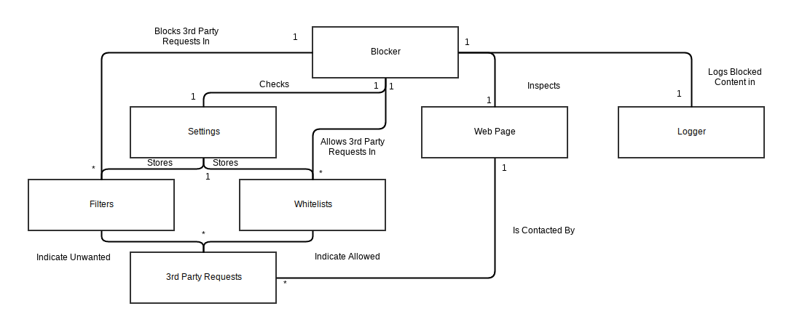

# Relatório 2 - Elicitação de Requisitos

## Índice
1. [Requisitos](#requisitos)
1. [Requisitos Específicos e Funcionalidades](#requisitos-especificos)
1. [Casos de Uso](#casos-de-uso)
1. [Modelo de Domínio](#modelo-de-dominio)

***
<a name="requisitos"/>
## Requisitos

*uBlock Origin* (ou *uBlock₀*) nasce da necessidade de bloquear anúncios e *scripts* de modo a tornar *websites* mais rápidos e menos poluídos com conteúdo não desejado. Para além desse objetivo, o modo avançado da extensão proíbe a execução todos os pedidos de comunicação de terceiros, a não ser que seja permitido pelo utilizador.

Segundo o criador, anúncios, intrusivos ou não, são métodos de invasão de privacidade utilizados na maioria dos *sites* da *Internet*. O objetivo do *uBlock Origin* é desativar esses métodos e devolver a privacidade aos seus utilizadores, mantendo uma interface simples para pessoas com menor conhecimento técnico.

De modo a concretizar o seu propósito, o *uBlock Origin* vem com alguns domínios pré-instalados. Apesar disto, é possível desativá-los e adicionar domínios personalizados.

Neste momento, o programa já atingiu o seu estado de maturação. Como tal, o seu foco passa, atualmente, por corrigir [problemas](https://github.com/gorhill/uBlock/issues) de filtragem e de interface.

### Criação de Funcionalidades

A equipa deste projeto é de apenas um elemento, tendo outros contribuidores uma muito pequena porção da produção de código. Como tal, as funcionalidades e correções são implementadas por este elemento, maioritamente.

Para incentivar a contribuição, existe um [ficheiro](../CONTRIBUTING.md) que explica todo o procedimento para criar uma boa descrição de cada *issue*.

<a name="requisitos-especificos"/>
***
## Requisitos Específicos e Funcionalidades

Os requisitos funcionais do projeto *uBlock Origin* são bastante simples: Permitir ao utilizador bloquear *scripts* e pedidos de comunicação de terceiros, como anúncios, trackers e sites de malware.

No que toca aos requisitos não funcionais, é um dos objetivos do criador disponibilizar as funcionalidades do programa de uma forma que não seja proibitiva aos utilizadores que não tenham conhecimento técnico dos meios utilizados pela extensão, isto é, ser facilmente usado por um utilizador leigo.

***
<a name="casos-de-uso"/>
## Casos de Uso
É importante, o utilizador em geral, saiba as funções e utilidades do programa em uso. No diagrama seguinte podemos verificar, as funcionalidades do uBlock.

De seguida vamos mencionar, as utilidades das principais funções ao qual o utilizador tem acesso.

* ### Dashboard
Painel de controlo do uBlock, onde o utilizador pode dar *enable* ou *disable* das permissões das páginas do qual visita.

* ### Block mode
Local onde o utilizador indica o grau de *blocking* que quer aplicar. No diagrama seguinte, estão identificados os graus possíveis de selecionar pelo utilizador.

* ### Element picker
O utilizador pode remover ou criar filtros a nível consmético, de elementos do qual não quer que apareçam mais, ou que apareçam numa posição diferente, entre outras.

* ### Strict blocking
A funcionalidade é restringir por completo uma página, de forma a que não seja establecida uma única conexão para o servidor onde se encontra a página.

* ### The logger
Permite ao utilizador inspecionar o que o uBlock está a fazer relativamente, aos pedidos de rede e elementos DOM.

* ### Dynamic filtering
É uma filtragem de *URL*, sendo uma ferramenta de diagnóstico para corrigir situações de quebra de páginas web.

* ### DOM inspector
Comparativamente à funcionalidade do *The logger*,o *DOM inspector* é especificamente para auxiliar na criação de filtros cosméticos.

<a name="modelo-de-dominio"/>

***
## Modelo de Domínio

Todas as etiquetas devem ser lidas de cima para baixo.

***
## Grupo e Contribuição

* Bernardo Belchior - up201405381 - 33,33%
* Edgar Passos - up201404131 - 33,33%
* José Pedro Monteiro - up201406458 - 33,33%
