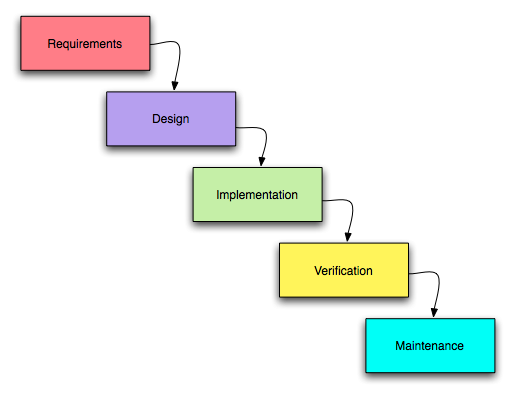

# Relatório 1

<h1>

*uBlock*Origin

</h1>
## Descrição do Projeto

*uBlock Origin* não é, especificamente, um *ad blocker*, é um bloqueador de *scripts* em geral. Isto é, o seu objetivo não é só bloquear anúncios, mas também pode ser usado de modo a não permitir a execução de programas que o utilizador não considere seguros. Além de bloquear *scripts*, este programa também permite que as páginas *web* carreguem mais rápido, uma vez que retira a necessidade do *browser* descarregar anúncios e outros ficheiros. O *uBlock*é bastante flexível uma vez que que as regras de filtros podem ser personalizados pelo utilizador. Foi desenvolvido com o principal objectivo de neutralizar a invasão de privacidade por parte de anúncios.

O *uBlock* inicialmente estava integrado num outro projeto - [*httpswitchboard*](https://github.com/gorhill/httpswitchboard) - que fornecia uma extensão ao navegador *Chromium* na qual o utilizador podia listar quais os pedidos da página em utilização podiam ser executados (*cookies, images, plug-in's, scripts, etc*). Após a divisão do *httpswitchboard* em dois projetos diferentes, o *uBlock* tornou-se mais parecido com um *ad blocker* geral, enquanto o [*uMatrix*](https://github.com/gorhill/uMatrix) manteve a maioria da funcionalidade anterior do seu antecessor.

O *uBlock Origin* vem incluído com 4 modos:

**Very easy mode** - apenas bloqueia anúncios, segundo os filtros da [*EasyList*](https://easylist.to/), que são os mesmo usados pelos [*AdBlock Plus*](https://adblockplus.org/).

**Easy mode** - modo pré-definido que não só utiliza os filtros da [*EasyList*](https://easylist.to/), como também acrescenta os providenciados por [*Peter Lowe's Ad server list*](https://pgl.yoyo.org/adservers/serverlist.php?hostformat=adblockplus&showintro=1&mimetype=plaintext) e diminui a exposição de privacidade usando [*EasyPrivacy*](https://easylist.to/easylist/easyprivacy.txt). Utiliza também alguns filtros de *malware*.

**Medium mode** - modo para utilizadores avançados, similar à utilização do [*AdBlock Plus*](https://adblockplus.org/) e [*NoScript*](https://noscript.net/). Este modo irá aumentar significativamente a *performance* do *browser* e diminuir drasticamente a exposição de privacidade do utilizador. Há a possibilidade de algumas paginas *web* não carregarem corretamente.

**Hard mode** - modo para utilizadores avançados que bloqueia todo o tipo de interação com terceiros e contém umas regras míninas para que a página carregue corretamente.

O projeto está licenciado de acordo com a licença [GPLv3](../LICENSE.txt).

## Processo de Desenvolvimento

O projeto é um *spin-off* de [*httpswitchboard*](https://github.com/gorhill/httpswitchboard) e, como tal, herdou o processo de desenvolvimento do seu antecessor - o modelo Cascata.
Inicialmente, o programador reuniu os requisitos do que pretendia fazer e planeou o projeto. Após essa fase, desenhou e implementou as funcionalidades-chave da extensão. Utilizando a ferramenta [*Travis-CI*](https://travis-ci.org/), o desenvolvedor estabelece testes automáticos que são executados sempre que existe um *push* para o repositório do projeto, permitindo a verificação do programa. Atualmente, o projeto encontra-se na fase de manuntenção, em que o programador se limita a resolver problemas de compatibilidade entre navegadores e aumentar o espetro de anúncios bloqueados.

### Contribuição

O projeto ainda se mantém ativo, com o seu criador a fazer alterações ao código diariamente. Contudo, não parece ser muito aberto a outros contribuidores, uma vez que 99% dos *commits* realizados são pelo desenvolvedor principal e o [ficheiro sobre contribuições](https://github.com/gorhill/uBlock/blob/master/CONTRIBUTING.md) informa que os utilizadores "não devem submeter *pull requests*".

## Críticas e Opiniões

### Estrutura do repositório
O projeto em análise, na opinião do grupo, está corretamente estruturado e organizado. Dado que repositório só tem um desenvolvedor ativo, é compreensível a existência de apenas 3 ramos:
* *master*;
* *next* - para desenvolvimento de novas funcionalidades;
* *chrisaljoudi* - *branch* inativo utilizado por um antigo contribuidor, que não é atualizado há mais de um ano.

### Atividade
O projeto encontra-se ativo e, desde a sua criação, tem uma média de 3 a 4 *commits* por dia. Mais recentemente, o número médio de commits tem permanecido estável. Apesar da alta atividade por parte do responsável do projeto ([*Raymond Hill*](https://github.com/gorhill)), este não mostrou muito interesse em colaborar, uma vez que o contactámos para nos informarmos melhor sobre o projeto, mas não obtivemos resposta.
O repositório encontra-se com cerca de 150 *issues* abertos atualmente, sendo que a maioria se deve a problemas com as listas de filtros.

## Grupo e Contribuição

* Bernardo Belchior - up201405381 - 33,33%
* Edgar Passos - up201404131 - 33,33%
* José Pedro Monteiro - up201406458 - 33,33%
