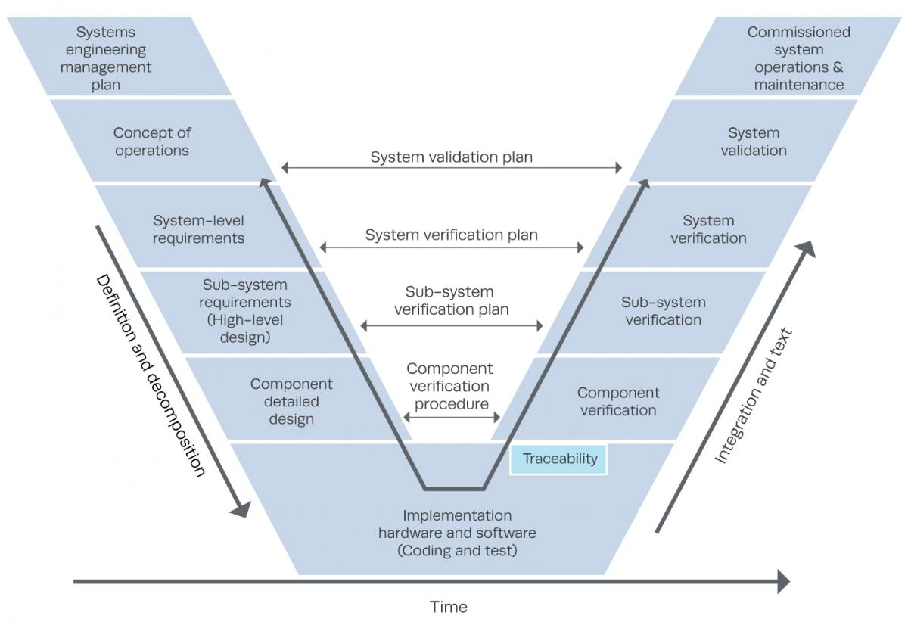

# Relatório 4 - Verificação e validação

## Índice
1. [Introdução](#introducao)
1. [Testabilidade do Software](#testabilidade)
1. [Estatísticas e análise de teste](#estatisticas)
1. [Correção de Bug](#correcao)

<a name="Introdução"/>
## Introdução

Na *Engenharia de Software*, a **verificação e validação (V&V)** é um processo de confirmação do que uma determinada aplicação cumpre os requisitos e especificações de um determinado cliente. Este processo devide-se então em duas componentes, tal como o nome indica:

* **Verificação** - visa assegurar que o software seja desenvolvido de um modo apropriado e consistente.  *Are we building the software right ?*

* **Validação** - Visa assegurar que o software corresponda aos requisitos establecidos. *Are we building the product right ?*

No diagrama seguinte podemos, compreender melhor o ciclo de vida das atividades segundo este processo:

Neste processo de **verificação e validação** são usadas alguma técnicas como as indicadas a seguir:

* **Técnicas estáticas**: Inspeção, análise e verificação formal.

* **Técnicas dinámicas**: Testes e verificação automática.

<a name="testabilidade"/>
## Testabilidade do Software

Testabilidade do Software caracteriza-se pelo grau de suporte de testes, num determinado artefacto da aplicação, num determinado contexto. Se a testabilidade de um artefacto for elevada, então encontrar *bugs*, através de testes, torna-se muito mais fácil assim como a sua correção mais acessível. Um menor grau de testabilidade resulta num esforço maior de testes, sendo que em casos mais extremos, a falta de testabilidade pode impossibilitar os testes em partes do software.

Como forma de relacionar a testabilidade com a dificuldade de encontrar no programa, uma medida relevante para avaliar a testabilidade é o número de casos de teste necessários para formar um conjunto completo de testes. Se o número for pequeno então a testabilidade é alta tendo uma relação de porporcionalidade inversa.

O *uBlock* não usa casos de teste em específico, sendo que utiliza o [*Travis CI*](https://travis-ci.org/) para a cada *commit* verificar se existe erros no programa, ao fazer *build* do programa com as especificações indicadas. Estas especificações são indicadas num ficheiro *.travis.yml* que é adicionado a raiz do projeto.

* ### Controlabilidade
 * Possibilidade de controlar o estado de uma componente sob teste (*CUT*).

Uma vez que o *uBlock* apenas usa o *Travis CI* para a relização de testes ao programa, o controlo em relação a estes torna-se um pouco baixo visto que apenas podemos dar especificações e/ou alterar a componente, antes do inicio da realização dos testes uma vez que estes realizam-se a cada *commit* seguido de um *push*, realizado. No entanto podemos controlar os testes do programa, em que, no ficheiro *.travis.yml* podemos personalizar a compilação do programa (indicar qual ficheiro de testes queremos verificar), instalar dependências ou até configurar uma base de dados. Quando realizado então o *commit* seguido do *push*, o *Travis CI* trata de verificar se os testes que se encontram no ficheiro indicado no ficheiro *.travis.yml* passaram ou não.

* ### Observabilidade
 * Observação dos resultados dos testes, intermédios e finais.

 Sendo que o *uBlock* usa o *Travis CI* em que este possuí uma *API* própria para a verificação dos resultados dos testes, torna-se simples a verificação dos resultados. Através desta *API* podemos verificar o *branch* do qual foi realizado o *commit*, quantos testes passaram (consequentemente, também os que nao passaram), o tempo que cada ficheiro de teste específico demorou assim como o tempo total da realização dos testes de todos os ficheiros. No entanto, apenas conseguimos observar os resultados dos testes no final da verificação de cada ficheiro.

* ### Isolabilidade
 * Possibilidade de uma *CUT* ser testada isoladamente.

O programa de testes (*Travis CI*) usado pelo *uBlock*, permite testar componentes isoladamente, no entanto, a isolabilidade das *CUT* no *uBlock* decresce de acordo com o grau de dependência de outras componentes. Uma vez que o *uBlock* é um projeto do tipo *web*, em que por exemplo, todos a

* ### Separação de preocupações

* ### Compreensibilidade

* ### Heterogenidade
 * Determina o grau em que o uso de diversas tecnologias requer diversos casos de teste.

 O *uBlock* não uma elevada heterogenidade uma vez que apenas realiza testes do tipo, teste funcional e teste de configuração. Os testes realizados têm aproximadamente a mesma estrutura em que o objetivo é testar as funcionalidades do *uBlock* em diferentes browsers (*Chrome, Firefox, Opera, entre outros*).

 No entanto, apesar da pouca heterogenidade dos testes, queremos que que são suficientes para garantir a boa consistência do *uBlock*.

<a name="estatisticas"/>
## Estatísticas e análise de teste

<a name="correcao"/>
## Correção de Bug
